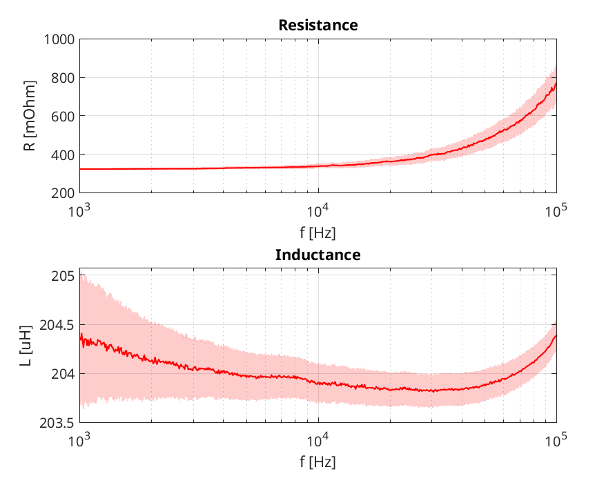

# MATLAB Tool for the Impedance Analyzer 4294A

This **MATLAB** tool offers different functions for working with the **HP/Agilent/Keysight 4294A impedance analyzer**.

The following function are implemented:
* **Read measurement file**
* **Get the device tolerances**
* **Add the tolerances to a measurement**

## Example

The following examples are included:
* [run_device_tol.m](run_device_tol.m) - Get and plot the device tolerances
* [run_meas_tol.m](run_meas_tol.m) - Read a measurement file, add the tolerances, and plot

    
    

## Compatibility

The tool is tested with the following MATLAB setup:
* Tested with MATLAB R2018b or 2019a
* No toolboxes are required.
* Compatibility with GNU Octave not tested but probably easy to achieve.

## References

The following references describes the impedance analyzer 4294A:
* Agilent 4294A Precision Impedance Analyzer, Operation Manual, 2003
* Agilent 4294A Precision Impedance Analyzer, Data Sheet, 2008

## Author

* **Thomas Guillod, ETH Zurich, Power Electronic Systems Laboratory** - [GitHub Profile](https://github.com/otvam)

## License

* This project is licensed under the **BSD License**, see [LICENSE.md](LICENSE.md).
* This project is copyrighted by: (c) 2016-2020, ETH Zurich, Power Electronic Systems Laboratory, T. Guillod.
